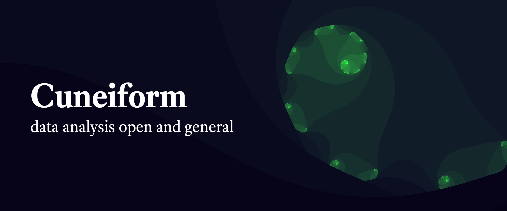

# Cuneiform

###### A functional language for large-scale scientific data analysis.

Distributed functional programming with foreign language interfacing.

Cuneiform is a minimal workflow specification language with immutable state,
lazy evaluation, lists, and second order functions operating on lists. In
this, it borrows from Functional Programming languages. Cuneiform
deliberately constrains users to specify workflows in a parallelizable way.
Its execution environment is designed for clusters and clouds. In addition,
functions (tasks) can be defined in any given scripting language, e.g.,
Bash, R, or Python. This way users can not only supplement features absent
in native Cuneiform but can reuse any tool or library no matter what API it
requires. For further information, please refer to the [Cuneiform paper](http://ceur-ws.org/Vol-1330/paper-03.pdf)

## Resources

- [cuneiform-lang.org](https://www.cuneiform-lang.org/). Official website of the Cuneiform programming language.
- [joergen7/cre](https://github.com/joergen7/cre). A common runtime environment (CRE) for distributed workflow languages.
- [joergen7/cf_client](https://github.com/joergen7/cf_client). A Cuneiform client implementation.
- [joergen7/cf_worker](https://github.com/joergen7/cf_worker). A Cuneiform worker implementation.

## Authors

- Jörgen Brandt ([@joergen7](https://github.com/joergen7/)) [joergen.brandt@onlinehome.de](mailto:joergen.brandt@onlinehome.de)

## License

[Apache 2.0](https://www.apache.org/licenses/LICENSE-2.0.html)